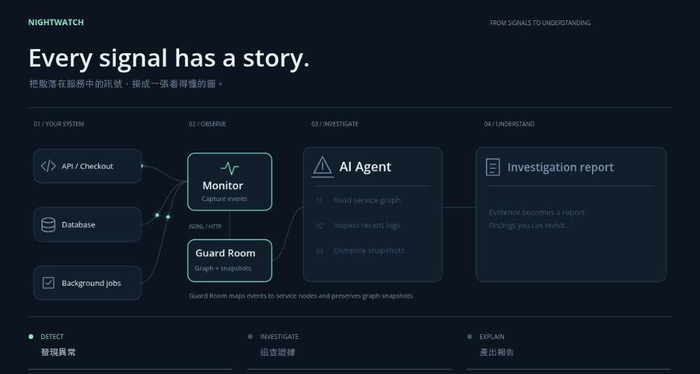
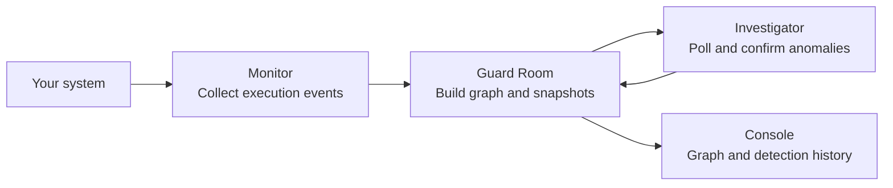

<p align="center">
  
</p>

<h1 align="center">NightWatch</h1>

<p align="center"><strong>From service signals to answers you can trace.</strong></p>

<p align="center">
  <strong>English</strong> · <a href="README.zh-TW.md">繁體中文</a>
</p>

<p align="center">
  <a href="#how-it-works">How it works</a> ·
  <a href="#connect-your-system">Connect your system</a> ·
  <a href="#quick-start">Quick start</a>
</p>

---

NightWatch connects service health, logs, and historical snapshots. The current release separates Guard Room from an independent Investigator that confirms persistent anomalies and recovery.

The AI loop is being rewritten and is not connected in this release. No model key is needed; manual AI investigation, thinking, reports and repair are unavailable. See the [current architecture](investigator/SYSTEM_DESIGN.md).

This repository includes a storefront integration example spanning products, carts, checkout, and database operations.

## How it works

The illustration below shows the broader investigation concept; AI investigation and reporting are future work in the rewritten service.

<p align="center">
  
  <br>
  <sub>Workflow illustration · Detect → Investigate → Explain · <a href="docs/readme/nightwatch-workflow.gif">View full size</a></sub>
</p>

<details>
<summary>View the static flow</summary>



</details>

1. **Observe.** Monitor captures function execution, duration, logs, and exceptions, then sends events through JSONL or HTTP.
2. **Build observations.** Guard Room maps events to service nodes, calculates health indicators, and saves snapshots.
3. **Confirm anomalies.** Investigator polls graph snapshots and independently confirms persistent anomalies and recovery for each node.
4. **Review evidence.** Console reads Guard Room APIs to display detection history and the exact triggering/recovery observations.

## Connect your system

The integration boundary is **service signals and a configured graph**. Map your monitors to service nodes; Investigator reads the resulting graph through HTTP.

- **Python services:** instrument selected functions with `@monitor(MonitorConfig(...))` and deliver events through JSONL or the background HTTP sink.
- **Other systems:** implement an adapter that sends `nightwatch.log.v1` events to `POST /api/logs`, with a configured `monitor_id` → node mapping.
- **OpenTelemetry (OTel):** an OTel integration would use an adapter to this event format; that adapter and native OTLP ingestion are not included yet.

Start with the [Monitor guide](monitor/README.md), [graph configuration](guardroom/README.md), and [HTTP API](guardroom/backend/README.md).

## Quick start

You need Git, Docker + Compose, Python 3, curl, and lsof. Run these commands from the repository root:

The independent detection service is included in Compose. AI is not connected; model credentials are not used.

```sh
git clone https://github.com/davidleitw/nightwatch-hack.git
cd nightwatch-hack

# Build and start the storefront, Guard Room, Investigator, and Console.
./restart.sh
```

Initial image pulls and dependency installation may need network access. Once prepared, the local monitoring and detection stack can run offline.

| Open | Default address |
| --- | --- |
| Console — service graph and detections | http://127.0.0.1:4173 |
| Storefront — generate service activity | http://127.0.0.1:8080 |
| Guard Room — interactive API docs | http://127.0.0.1:9999/docs |

Browse products and use checkout to generate observations. Open Console to inspect the graph and detection history.

```sh
# Check service availability and the current graph.
curl --fail-with-body http://127.0.0.1:8080/api/health
curl --fail-with-body http://127.0.0.1:9999/health
curl --fail-with-body http://127.0.0.1:9999/api/graph

# Start using existing Docker images, or stop while preserving data.
# ./restart.sh --open
# ./restart.sh --close
```

The startup script preserves existing host ports; its output lists the actual addresses. Port overrides, data persistence, and deployment settings are in the [deployment guide](guardroom/README.md).

The local storefront topology includes **18 operation nodes** across checkout, catalog, cart, and cross-service prepare/complete/abort calls. The Console defaults to six primary nodes plus warning/failing nodes; expand all observation points for full coverage. See [monitor definitions](guardroom/MONITORS.md) for units, thresholds, and gaps. Catalog/cart database metrics, pending requests, and order health mapping remain incomplete.

## Project map

| Component | Responsibility |
| --- | --- |
| [Monitor](monitor/README.md) | Capture function events and deliver them to Guard Room |
| [Guard Room](guardroom/README.md) | Graph aggregation and browser-facing APIs plus the web console |
| [Investigator](investigator/README.md) | Independent observation, anomaly confirmation and persistent detection events |
| [Example Shop](examples/shop/README.md) | Example workload with gateway, catalog, cart, order, and frontend services |

## What's next

Next: add a separate investigation manager and Runner behind the published service contract, then evidence and reports. Today the core workflow is **monitoring → detection → observation history**. Missing measurements remain unknown.

<p align="center"><strong>From signals to understanding.</strong></p>
