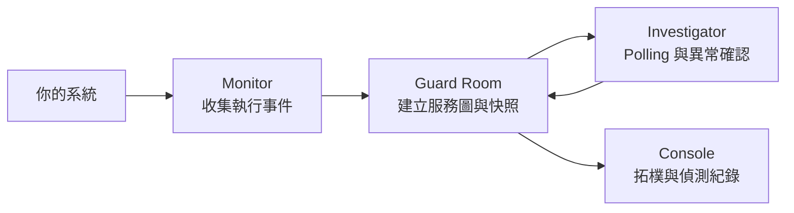

<p align="center">
  
</p>

<h1 align="center">NightWatch</h1>

<p align="center"><strong>從服務訊號，找到有據可查的答案。</strong></p>

<p align="center">
  <a href="README.md">English</a> · <strong>繁體中文</strong>
</p>

<p align="center">
  <a href="#運作方式">運作方式</a> ·
  <a href="#接入你的系統">接入你的系統</a> ·
  <a href="#快速開始">快速開始</a>
</p>

---

NightWatch 串起服務健康狀態、日誌與歷史快照。目前版本將 Guard Room 與獨立 Investigator 分離，由 Investigator 確認持續異常與恢復，Guard Room 提供前端資料。

AI loop 正在重寫，此版尚未接入。無需模型金鑰，手動 AI 調查、thinking、報告與修復目前不可用。詳見[目前架構](investigator/SYSTEM_DESIGN.md)。

Repository 提供購物網站整合範例，涵蓋商品、購物車、結帳與資料庫操作。

## 運作方式

下方動畫是完整調查流程的概念示意；新版服務的 AI 調查與報告仍屬後續工作。

<p align="center">
  
  <br>
  <sub>流程概念動畫 · 發現異常 → 追查證據 → 產出報告 · <a href="docs/readme/nightwatch-workflow.gif">查看原尺寸</a></sub>
</p>

<details>
<summary>展開靜態流程圖</summary>



</details>

1. **收集觀測。** Monitor 記錄函式執行、耗時、日誌與例外，透過 JSONL 或 HTTP 傳送事件。
2. **整理觀測。** Guard Room 對應節點、計算健康指標並保存服務圖快照。
3. **確認異常。** Investigator 定期讀取 graph，按節點獨立確認持續異常與恢復。
4. **查看依據。** Console 只經由 Guard Room 取得偵測紀錄、觸發與恢復時的完整觀測。

## 接入你的系統

對接的核心是**服務訊號與設定好的服務圖**。將 monitor 對應到服務節點後，Investigator 透過 HTTP 讀取 Guard Room graph。

- **Python 服務：** 用 `@monitor(MonitorConfig(...))` 標記需要觀測的函式，選擇 JSONL 或背景 HTTP 傳送。
- **其他既有系統：** 實作轉接層，將事件轉成 `nightwatch.log.v1` 送到 `POST /api/logs`，並設定 `monitor_id` → 節點對應。
- **OpenTelemetry（OTel）：** 可透過轉接層對接上述事件格式；目前尚未內建此轉接層與原生 OTLP 接收。

接入細節見 [Monitor 指南](monitor/README.md)、[服務圖設定](guardroom/README.md)與 [HTTP API](guardroom/backend/README.md)。

## 快速開始

需要 Git、Docker + Compose、Python 3、curl 與 lsof。以下命令從 repository 根目錄執行：

Compose 已包含獨立 Investigator。此版本不執行模型，不需要設定模型金鑰。

```sh
git clone https://github.com/davidleitw/nightwatch-hack.git
cd nightwatch-hack

# 建置並啟動商店、Guard Room、Investigator 與 Console。
./restart.sh
```

首次下載映像與安裝依賴可能需要網路；備妥後，本機監測服務可離線運作。異常偵測不依賴模型服務。

| 開啟入口 | 預設網址 |
| --- | --- |
| Console — 服務圖與偵測紀錄 | http://127.0.0.1:4173 |
| 商店 — 產生服務活動 | http://127.0.0.1:8080 |
| Guard Room — 互動式 API 文件 | http://127.0.0.1:9999/docs |

瀏覽商品、操作結帳以產生觀測，再打開 Console 查看服務圖與偵測紀錄。

```sh
# 確認服務可用，並取得目前服務圖。
curl --fail-with-body http://127.0.0.1:8080/api/health
curl --fail-with-body http://127.0.0.1:9999/health
curl --fail-with-body http://127.0.0.1:9999/api/graph

# 使用既有 Docker 映像啟動，或停止服務並保留資料。
# ./restart.sh --open
# ./restart.sh --close
```

啟動腳本會沿用既有 host port，實際網址以執行輸出為準。連接埠覆寫、資料保存與部署設定見 [部署指南](guardroom/README.md)。

本機商店拓樸包含 **18 個操作節點**，涵蓋結帳、商品、購物車及跨服務 prepare／complete／abort。Console 預設顯示六個主要節點與警告／異常節點，可展開全部觀測點。指標單位、門檻與缺口見 [Monitor 定義](guardroom/MONITORS.md)；catalog／cart DB、等待中請求及 order health 映射仍待補齊。

## 專案導覽

| 元件 | 負責什麼 |
| --- | --- |
| [Monitor](monitor/README.md) | 收集函式事件並傳送至 Guard Room |
| [Guard Room](guardroom/README.md) | 監測聚合與前端 API，以及 Web 操作介面 |
| [Investigator](investigator/README.md) | 獨立觀測、異常確認與持久化偵測事件 |
| [Example Shop](examples/shop/README.md) | 包含 gateway、catalog、cart、order 與前端的範例 workload |

## 接下來

擴充更多觀測來源、加深服務監測覆蓋，並加入人工批准修復與執行後驗證。目前核心流程是**監測 → 調查 → 報告**；觀測範圍取決於已設定的監測點，缺少的量測保留為未知。通用自動修復仍是後續工作。

<p align="center"><strong>從看見異常，到理解原因。</strong></p>
