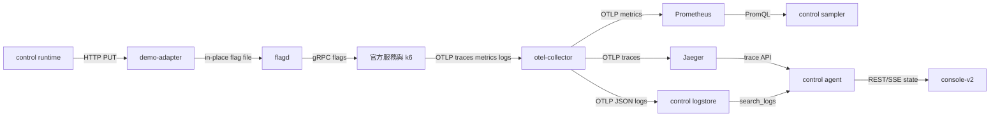

# OTel Demo 資料流

整合層有三條 telemetry/control/log 流。它們共用 service name 與時間窗，
但來源和可靠性不同；control 不把其中一條推測成另一條。

## Trace 流

官方服務和 k6 將 OTLP traces 送 collector。traces pipeline 先做 span name
清理，再送 `span_metrics`、`service_graph` 與 Jaeger。control 不直接讀
collector；Agent 的 `find_traces` / `get_trace` 透過 Jaeger API 取得摘要與
單筆 trace。service graph 可能出現 manifest 以外的 upstream/virtual node，
control 只投影 manifest 宣告的 nodes/edges。

`span_metrics` 的 label 維度包含 `peer.service`、`http.route`、
`server.address`、`db.system.name`、`messaging.system` 等。datastore/queue
選擇器由 manifest `selector` 提供，PromQL 細節只看 [`../METRICS.md`](../METRICS.md)。

## Metrics 流

metrics pipeline 將 OTLP metrics 與 collector receivers 統一送 Prometheus。
來源包括官方服務、k6、Redis、PostgreSQL、Kafka metrics、nginx 與 ad scrape。
control 每 5 秒組一張快照，保存環形歷史、baseline、status、trend 與 extras。

目前的 control metrics 來源分工如下：

| 節點類型 | 主要來源 | 觀測內容 |
| --- | --- | --- |
| service | span metrics、revision gauge | traffic、errors、p95、liveness、revision |
| synthetic | k6 checkout series | customer traffic、fail ratio、p95、liveness |
| datastore | client span + DB/Redis receiver | request、error、latency、pool extras |
| queue | producer span + Kafka metrics | traffic、lag/depth、owner liveness |

沒有資料的軸是 `null`，不是零。Declared edge 的 `observed` 也由當下 span
資料決定，不代表 manifest 邊永遠有流量。

## Log 流

collector logs pipeline 丟棄 body 含 `feature flag` 或 `flagd` 的題面洩漏，再
以未壓縮 OTLP/HTTP JSON POST 到 control `:3001/internal/otlp`。control 只存
精簡的時間、service、severity、body、trace id；Agent 的 `search_logs` 從
這裡查。這條流不是 monitor/v1alpha2，完整 error event 另見
[`ERROR-LOG.md`](ERROR-LOG.md)。

## Control 與 runtime 流

故障注入和批准後修復都走 demo-adapter，不直接修改官方容器環境。adapter
將 revision/knobs 寫入 flagd 檔案，並輸出 `shop_config_revision` gauge 與
只有 revision 改變時才輸出 `config applied` log；gauge 使用
`job="shop/<target>",revision="..."`，沒有 target label。官方服務下次讀 flag
後，其 traces/metrics 回到上述流。
control 以 `/api/state`、SSE `/events` 把投影送給 console。

資料流的最小診斷順序是：先看 readiness 與 graph source，再看 Prometheus
查詢是否有數字，接著用 Jaeger/`search_logs` 找原因，最後才確認 adapter
config、flagd OFREP 與 revision。不要用 flagd 的當前值取代已發生的 trace/log
證據。

## 三條流的 source 與失敗語意

| 流 | source of truth | 主要失敗 | 讀者應如何解釋 |
| --- | --- | --- | --- |
| telemetry | collector config、Prometheus、Jaeger | receiver/exporter/batch/sampling | projection 可能延遲或缺欄位 |
| control | manifest、checks、snapshot ring | query timeout、selector mismatch | 只報宣告能力與目前觀測 |
| log | OTLP log record、control logstore | filter、15 分鐘 retention、容量裁切 | `search_logs` 命中是 evidence，沒命中不是健康 |

trace、metric、log 共享 `service.name` 時才可直接關聯；若 resource attrs 不同，
要保留原始值並說明 mapping。`traceId` 只能連到 Jaeger 中已存在的 trace，不能
因為 log 有 id 就推斷整條 service graph 都成功。

## Control snapshot 的邊界

control sampler 以固定週期取 Prometheus 和 health/check 結果，將結果壓成 graph
node/edge projection。當 Prometheus 沒有 series 時，該 axis 保持 `null`；當
宣告 edge 沒有本窗 span 時，`observed=false`。這兩種情形都要與數值零、服務
死亡、拓撲不存在分開。

runtime PUT 是另一條控制流。它改變 flagd 的下一次 evaluation，之後才可能在
新的 trace/metric/log 中看到影響。control 的 proposal、approval、revision 和
verification evidence 形成 audit chain；flagd 當前值本身不是故障發生時間的
證據。

## 建議的現場讀法

1. 確認 collector、Prometheus、Jaeger、control readiness 與 adapter health。
2. 以 manifest node/selector 讀 graph 與 metrics，保留查詢時間窗。
3. 對 root candidate 查 Jaeger trace，再用同一 service 和時間窗查 logs。
4. 若需要修復，先 inspect runtime、產生 exact proposal，批准後觀察兩個窗口。
5. 把 upstream status、projection delay、缺失訊號和 action revision 一起保存。

這個順序不能取代 `AGENT.md` 的工具限制；它只是把不同 projection 的來源與
不確定性放在同一張接線圖上。
